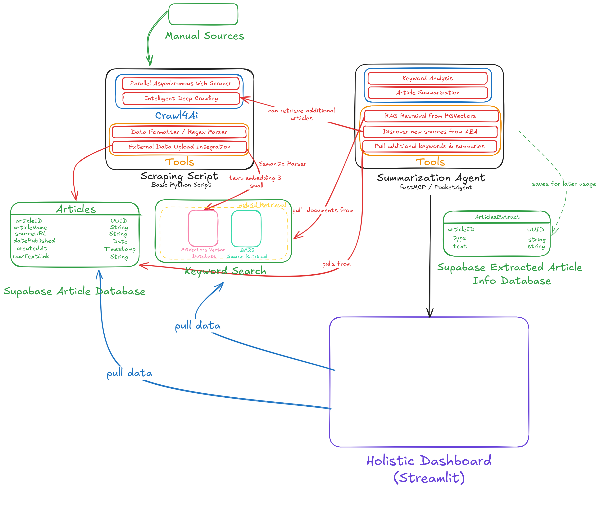
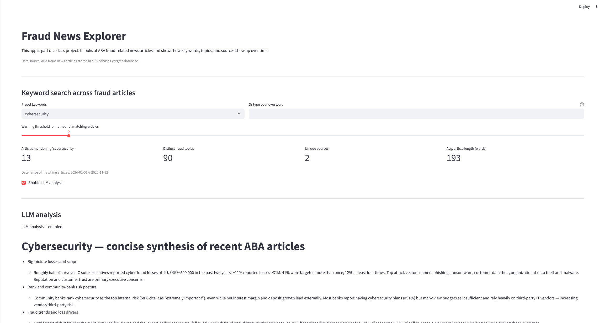
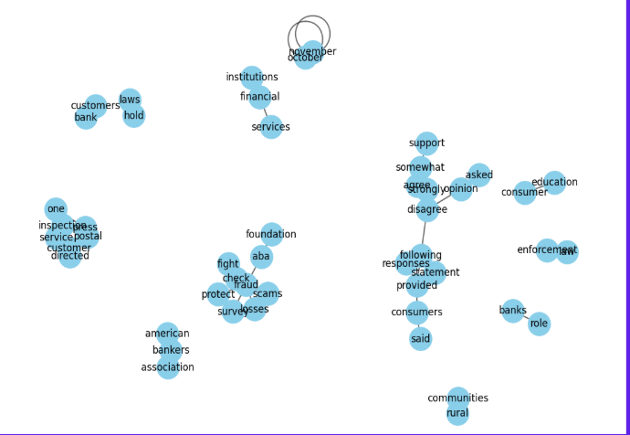
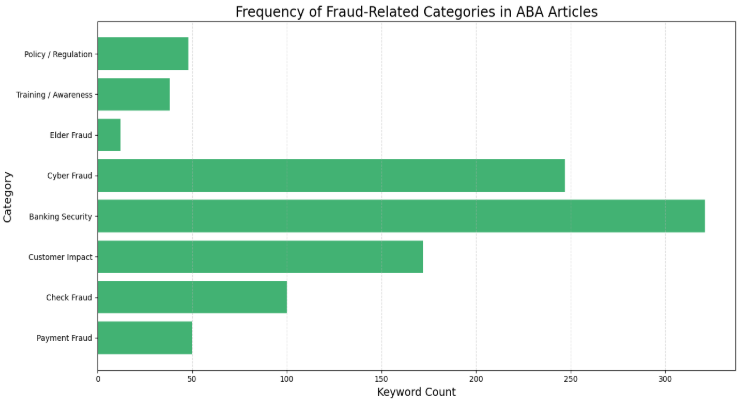

# ABAFraudNLP

AI-powered NLP system for scraping, enriching, and analyzing fraud-related articles from the American Bankkers Association (ABA).

**Team:** Arnav Sareen • Maksim Dimitrijević • Ana Abreu • Nabeel Balighuddin  
UNC Charlotte • DTSC 3602 – USAA Fraud Analytics Project  

---

## 1. Clear First Impression

**One-sentence summary:**  
ABAFraudNLP automatically scrapes ABA fraud articles, cleans and processes them, generates LLM-powered summaries and keywords, embeds them using OpenAI vectors, and visualizes fraud trends in a searchable Streamlit dashboard backed by Supabase.

---

## 2. Quick Start

### Install with `uv`
```bash
uv sync
````

### Environment Variables

The app expects a `.env` file inside the `config/` directory.

```bash
cp config/.env.example config/.env
```

Then edit `config/.env`:

```env
OPENAI_API_KEY=your_key
SUPABASE_URL=your_supabase_url
SUPABASE_KEY=your_supabase_key
BM25_INDEX_PATH="./data/BM25.pkl" #optional
```

### Run the full pipeline

```bash
# 1. Scrape ABA articles → data/scraped_markdown_results/
uv run python scripts/scraper.py

# 2. Generate keywords using LLM agent
uv run python agents/summarization_agent.py

# 3. Upload articles + keywords + embeddings to Supabase
uv run python scripts/upload_to_supabase.py

# 4. (Optional) BM25 keyword search service
uv run python scripts/bm25.py
```

### Launch the Streamlit dashboard

```bash
uv run streamlit run streamlit/streamlit_app.py
```

---

## 3. Visuals / Application Design

### 3.1 Architecture Diagram



---

### 3.2 Streamlit Dashboard Visuals






---

### 3.3 Supabase Database Schema


---

### 3.4 Folder Structure
```
ABAFraudNLP/
├── agents/
│   ├── prompts.py
│   └── summarization_agent.py
├── config/
│   └── .env.example
├── data/
│   ├── scraped_markdown_results/
│   ├── scraped_json_results/
│   └── manual_search.txt
├── images/
├── scripts/
│   ├── scraper.py
│   ├── upload_to_supabase.py
│   └── bm25.py
├── streamlit/
│   └── streamlit_app.py
├── visualizations/
│   └── visualization.ipynb
├── pyproject.toml
└── README.md
```

---

## 3a. What We Did 

### 3a.1 Sample Articles

#### 3a.1.1: Manually Selected Sources:
**Source:**
`data\scraped_markdown_results\deloitte-2026-could-be-defining-year-for-banks.md`

**Preview:**

> “A coalition of consumer groups is urging voice service providers to take stronger action to combat fraudulent robocalls and phone-based scams. The groups emphasized the growing risks posed by spoofed caller IDs and called for more aggressive enforcement…”

#### 3a.1.2: Deep Crawled Sources:

**Source:**
`data/scraped_markdown_results/aba-consumer-group-urge-action-by-voice-service-providers-to-combat-fraud.md`

**Preview:**

> “Economic uncertainty could test U.S. banks’ revenues and profitability in 2026, and many institutions will likely need to make major decisions on stablecoins and artificial intelligence, according to a new report by the auditing and consulting firm Deloitte...”


---

### 3a.2 Minimal Example of LLM Keyword Extraction

```python
def get_embeddings(text: str):
    response = OPENAI_CLIENT.embeddings.create(
        input=text.lower().strip(),
        model="text-embedding-3-small"
    )
    return response.data[0].embedding
```

---

### 3a.3 Minimal Example of Embedding Generation

```python
from openai import OpenAI
client = OpenAI(api_key=os.getenv("OPENAI_API_KEY"))


emb = client.embeddings.create(
    model="text-embedding-3-small",
    input=clean_text
).data[0].embedding
```

---

### 3a.4 Minimal Example of BM25 Search

```python
bm25, tokenized = create_bm25_index(all_articles)
results = query_bm25_index("cyber fraud attack")
```

---

## 4. Clear Findings

### What This Project Reveals

* Banking Security and Cyber Fraud dominate ABA reporting
* Customer Impact appears frequently
* Elder Fraud and Training/Awareness are underrepresented
* Embeddings cluster articles into meaningful groups
* Co-occurrence patterns show strong links (e.g., Cyber Fraud ↔ Banking Security)

---

# Additional Links

* Streamlit: [https://streamlit.io](https://streamlit.io)
* Supabase: [https://supabase.com](https://supabase.com)
* crawl4ai: [https://github.com/unclecode/crawl4ai](https://github.com/unclecode/crawl4ai)

```
```


