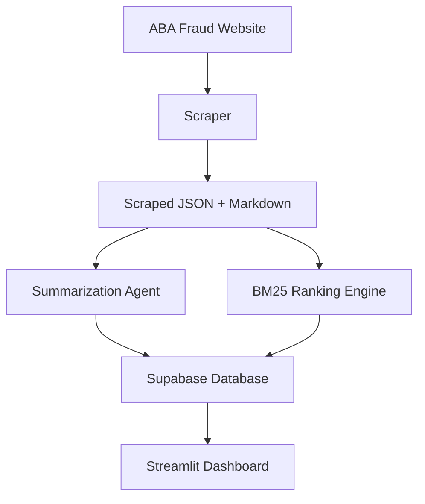

# ***ABAFraudNLP***

### AI-powered NLP system for extracting, ranking, and summarizing suspicious ABA banking fraud alerts

**Authors:** Maksim Dimitrijević, Arnav Sareen, Ana Abreu, Nabeel Balighuddin
UNC Charlotte — Data Science Project

---

## **1. Clear First Impression**

**One-sentence summary**
ABAFraudNLP scrapes ABA banking fraud alerts, transforms them into structured text, ranks them with BM25, and summarizes key insights with an LLM-powered agent through a Streamlit dashboard.

**Tagline**
From raw fraud alerts to searchable intelligence.

---

## **2. Quick Start**

### **Install dependencies**

```bash
uv sync
```

### **Set up environment variables**

Copy the template:

```bash
cp config/.env.example .env
```

Edit `.env` and include:

```
SUPABASE_URL=
SUPABASE_SERVICE_KEY=
OPENAI_API_KEY=
MODEL_NAME=
OUTPUT_DIR=
```

### **Run the scraper**

```bash
uv run python scripts/scraper.py
```

### **Upload scraped documents to Supabase**

```bash
uv run python scripts/upload_to_supabase.py
```

### **Run BM25 ranking**

```bash
uv run python scripts/bm25.py
```

### **Launch the Streamlit dashboard**

```bash
streamlit run visualizations/streamlit_app.py
```

---

## **3. Visuals and Application Design**

### **Architecture Diagram**



### **Folder Structure**

```
ABAFraudNLP/
├── main.py
├── .gitignore
├── config/
│   └── .env.example
├── agents/
│   ├── prompts.py
│   └── summarization_agent.py
├── scripts/
│   ├── scraper.py
│   ├── upload_to_supabase.py
│   └── bm25.py
├── data/
│   ├── scraped_json_results/
│   ├── scraped_markdown_results/
│   └── manual_search.txt
├── visualizations/
│   ├── Streamlit/
│   ├── visualization.ipynb
│   └── streamlit_app.py
└── Streamlit ui/
    └── streamlit_app.py
```

### **Screenshots (placeholders)**


### **GIF Demo Placeholder**


---

## **3.a What We Built (with code samples)**

### **Scraping Example**

```python
response = requests.get(url)
soup = BeautifulSoup(response.text, "html.parser")

item = {
    "title": title,
    "date": date,
    "content": cleaned_text
}
```

### **BM25 Ranking Example**

```python
bm25 = BM25Okapi(tokenized_docs)
scores = bm25.get_scores(query_tokens)
```

### **Summarization Agent Example**

```python
response = client.chat.completions.create(
    model=model_name,
    messages=[
        {"role": "system", "content": SYSTEM_PROMPT},
        {"role": "user", "content": user_input}
    ]
)
```

### **Streamlit UI Example**

```python
st.title("ABA Fraud Alert Search")
query = st.text_input("Enter a keyword or phrase")
results = search_engine.search(query)
```

---

## **4. Clear Findings**

### **Why this project is useful**

ABA fraud alerts are long, unstructured, and time-consuming to read.
ABAFraudNLP automates the entire process so fraud analysts can search, filter, and understand alerts instantly.

### **What the system achieves**

| Feature             | Benefit                                      |
| ------------------- | -------------------------------------------- |
| Automatic scraping  | Removes manual collection work               |
| LLM summaries       | Converts long reports into readable insights |
| BM25 ranking        | Finds the most relevant alerts               |
| Streamlit dashboard | Interactive search + summaries               |
| Supabase storage    | Centralized and scalable                     |

### **Example Insight**

```text
"Unauthorized ACH Attempt"
Score: 17.35
Summary: The attacker spoofed a payroll system and redirected funds using fraudulent routing numbers.
```

---

## **Run the Full Pipeline**

```bash
uv sync
cp config/.env.example .env
uv run python scripts/scraper.py
uv run python scripts/upload_to_supabase.py
uv run python scripts/bm25.py
streamlit run visualizations/streamlit_app.py
```


